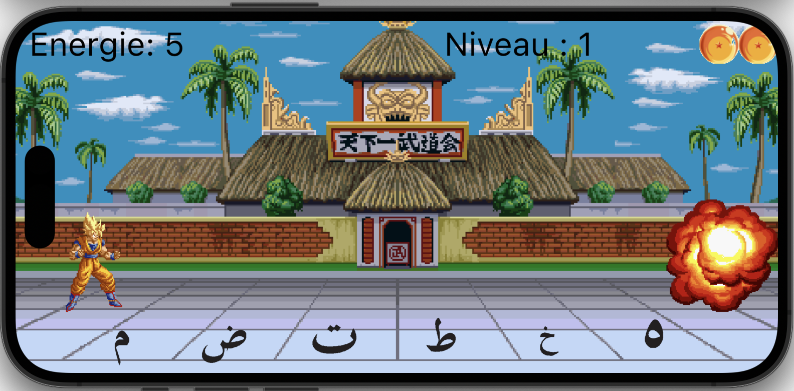
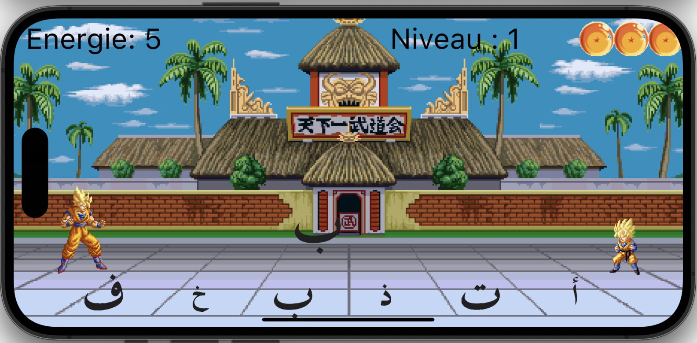
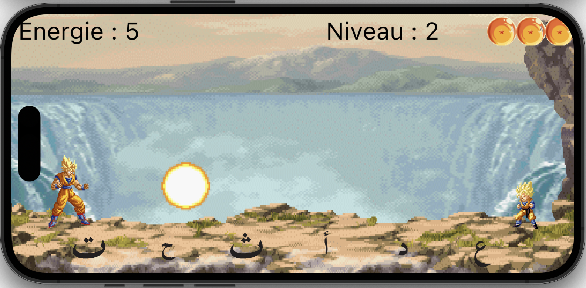
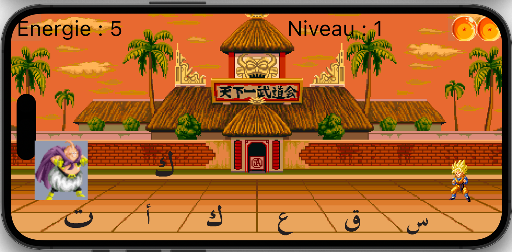

# Letter Fighter

It's a P.O.C. of educational game which the goal is to repel attack of the enemy that throw letters.
To repel the letter-attack you have to select the corresponding letter on a range of letters proposed in the bottom of the screen.
[Try game](https://guenoel.github.io/letter_fighter/build/web/){:target="_blank" rel="noopener"}

Introlink Featurelink AboutLink3

## Features

### Random spaw of enemy's letter and answer button's letter.
The enemy send a new letter randomly on each attack. The buttons to repel attack are also generated randomly except the button with the good answer that is placed randomly among others.

### Enemy letter replaced by a fireball on second level of the game.
After a learning period which the player see the letter and ear the song of the letter in the same time to memorize association between them, the letter thrown by the enemy is replaced by a fireball. The player have now to associate the song of the letter with the shape of the letter.

### Enemy and background will be replaced on each level.
So that the player realizes his progress, the background and the enemy will change on each level.

## About
